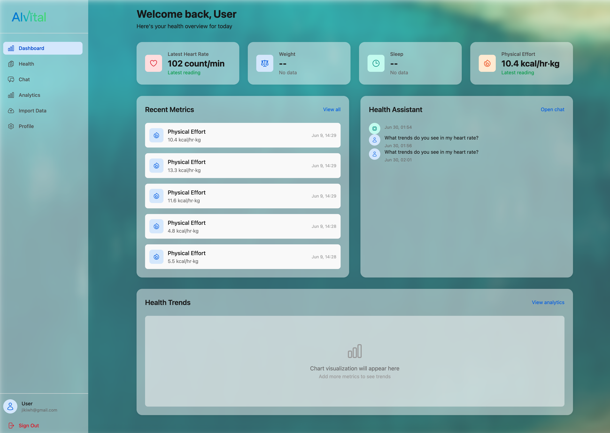
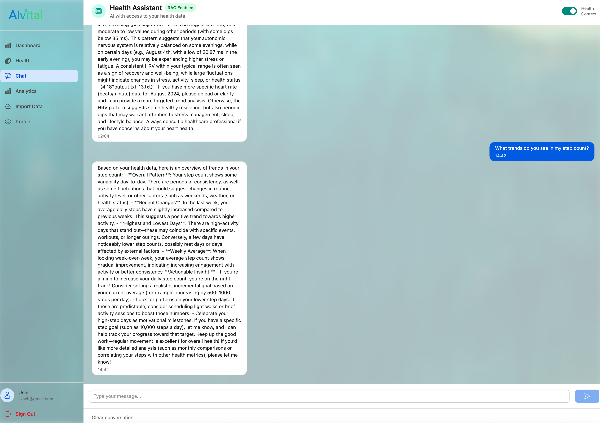
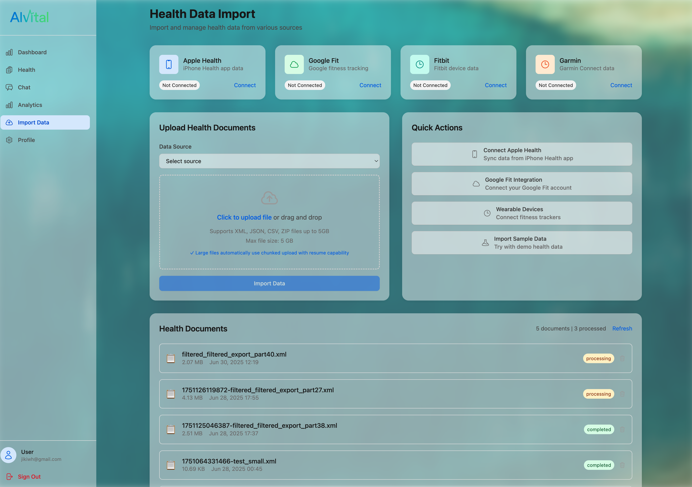

# Aivital - AI-Powered Health Monitoring & Data Import Platform

A comprehensive health tracking application with advanced data import capabilities, vector database integration, and AI-powered insights. Built with Vue 3, TypeScript, and Azure services.


*Screenshot of the Aivital health monitoring dashboard showing the modern, clean interface with health metrics visualization and AI chat integration.*

## 🌟 Key Features

### 🔐 **Secure Authentication & Privacy**
- Microsoft Entra External ID authentication
- Azure Cosmos DB with built-in security
- Comprehensive privacy controls and settings
- Secure password reset functionality

### 📊 **Advanced Health Monitoring**
- Track 11+ health metrics (blood pressure, heart rate, weight, sleep, etc.)
- Real-time data visualization and trends
- Custom metric types with flexible units
- Historical data analysis and insights

### 🤖 **AI Health Assistant**
- Context-aware health conversations
- Personalized advice based on your data
- RAG (Retrieval-Augmented Generation) powered responses
- Secure, privacy-focused AI interactions

### 📈 **Comprehensive Analytics**
- Interactive health trend visualizations
- Personalized health insights and recommendations
- Data export capabilities (CSV, PDF)
- Advanced pattern recognition

### 📥 **Universal Data Import System**
- **Apple Health XML** - Full support for Apple Health exports
- **Google Fit** - Import fitness and health data
- **Fitbit** - Sync wearable device data
- **Garmin Connect** - Import training and health metrics
- **Manual Upload** - CSV, JSON, XML file support
- **Vector Database Storage** - All imported data becomes searchable

### 🔍 **Vector Database & RAG**
- **Azure Cosmos DB** with vector search capabilities
- **Automatic embedding generation** for all health documents
- **Similarity search** across your entire health history
- **Context-aware AI responses** using your personal data

## 📱 Application Screenshots

### Dashboard Overview

*Main dashboard showing health metrics overview, recent activity, and quick access to key features.*


### AI Health Assistant

*AI-powered health assistant interface with context-aware conversations and personalized health advice based on your data.*

### Data Import Interface

*Universal data import system supporting Apple Health, Google Fit, Fitbit, and manual file uploads with real-time progress tracking.*


## 🚀 Quick Start

### Prerequisites
- **Node.js 18+** and npm
- **Azure account** with Cosmos DB, Blob Storage, and Key Vault
- **Microsoft Entra External ID** tenant setup

### 1. Clone & Install
```bash
git clone <repository-url>
cd health_monitor
npm install
```

### 2. Environment Setup
```bash
cp env.azure.example .env.local
```

Edit `.env.local` with your Azure credentials:
```env
# Microsoft Entra External ID Configuration
VITE_AZURE_CLIENT_ID=your-external-id-app-client-id
VITE_AZURE_TENANT_ID=your-external-id-tenant-id
VITE_AZURE_EXTERNAL_ID_DOMAIN=yourtenant.ciamlogin.com

# Azure Cosmos DB Configuration
VITE_AZURE_COSMOS_ENDPOINT=https://your-cosmos-account.documents.azure.com:443/
VITE_AZURE_COSMOS_KEY=your-cosmos-key
VITE_AZURE_COSMOS_DATABASE=HealthMonitorDB

# Azure Blob Storage Configuration
VITE_AZURE_STORAGE_ACCOUNT=your-storage-account-name
VITE_AZURE_STORAGE_CONTAINER=health-files
AZURE_STORAGE_CONNECTION_STRING=your-connection-string

# OpenAI API Configuration
VITE_OPENAI_API_KEY=your-openai-api-key
VITE_OPENAI_MODEL=text-embedding-3-small

# Backend Service Configuration
VITE_BACKEND_SERVICE_URL=http://localhost:3001/api
```

### 3. Backend Service Setup
```bash
cd backend-service
npm install
cp env.example .env
# Configure backend environment variables
npm run dev
```

### 4. Start Development
```bash
# In the root directory
npm run dev
```
Access the application at `http://localhost:5173`

## 🧪 Testing the Application

### Demo Account
For testing purposes, you can create a new account or use these sample credentials:

**Test Account:**
- Email: `demo@aivital.com`
- Password: `demo123456`

*Note: This is a demo account - create your own for personal use*

### Testing Data Import

#### 1. **Apple Health Export Testing**
1. Go to **Import Data** page (`/import`)
2. Select "Apple Health Export" as source
3. Click "Import Sample Data" to generate demo Apple Health data
4. Monitor the import progress in real-time
5. View imported data in the **Health** section

#### 2. **Manual File Upload**
1. Create a sample JSON file with health data:
```json
[
  {
    "type": "heart_rate",
    "value": 72,
    "unit": "bpm",
    "date": "2024-01-15T10:30:00Z",
    "source": "manual"
  }
]
```
2. Upload via the drag-and-drop interface
3. Select appropriate source type
4. Process and view results

#### 3. **Vector Search Testing**
1. Import sample data (as above)
2. Go to **Chat** page
3. Ask questions like:
   - "What was my average heart rate last week?"
   - "Show me my sleep patterns"
   - "How has my weight changed?"
4. The AI will use vector search to find relevant data

### Testing Features

#### Health Metrics
1. **Add Metrics**: Go to Health page → "Add Metric"
2. **Test Different Types**: Blood pressure, weight, heart rate, etc.
3. **View Trends**: Check dashboard for visualizations
4. **Edit/Delete**: Test metric management features

#### AI Chat
1. **Health Questions**: Ask about your metrics
2. **General Advice**: Request health tips
3. **Data Analysis**: Ask for pattern insights
4. **Context Awareness**: Notice how AI references your data

#### Analytics
1. **Time Ranges**: Test different date filters
2. **Metric Types**: Filter by specific health metrics
3. **Export Data**: Test CSV/PDF export functionality
4. **Insights**: Review AI-generated health insights

## 🗄️ Database Schema

### Core Collections (Azure Cosmos DB)
- **`user_profiles`** - User information and preferences
- **`health_metrics`** - Individual health measurements
- **`chat_messages`** - AI conversation history
- **`analytics_data`** - Aggregated health analytics

### Vector Database Collections
- **`health_documents`** - Imported health documents
- **`health_embeddings`** - Vector embeddings for RAG
- **`import_sessions`** - Import tracking and progress
- **`data_sources`** - Connected health app integrations

### Security
- **Azure Cosmos DB** built-in security features
- **Microsoft Entra External ID** authentication
- **User isolation** - Users can only access their own data
- **Encrypted tokens** for external service connections

## 📁 Project Structure

```
health_monitor/
├── src/                    # Frontend Vue application
│   ├── components/         # Vue components
│   ├── pages/             # Page components
│   ├── stores/            # Pinia state management
│   ├── services/          # API and external services
│   └── types/             # TypeScript type definitions
├── backend-service/        # Node.js backend API
│   ├── src/
│   │   ├── services/      # Business logic services
│   │   └── routes/        # API routes
│   └── README.md          # Backend documentation
├── azure-functions/        # Azure Functions
│   ├── generate-embeddings/    # Vector embedding generation
│   ├── generate-query-embedding/ # Query embedding
│   └── process-health-file/     # File processing
├── infrastructure/         # Azure infrastructure setup
└── public/                # Static assets
```

## 🔧 Available Scripts

```bash
# Development
npm run dev              # Start development server
npm run build           # Build for production
npm run preview         # Preview production build

# Testing
npm run test            # Run unit tests
npm run test:ui         # Run tests with UI
npm run test:integration # Run integration tests

# Code Quality
npm run lint            # Lint code
npm run type-check      # TypeScript type checking
```

## 🎯 How to Use Aivital

### Getting Started
1. **Sign Up**: Create account with Microsoft Entra External ID
2. **Complete Profile**: Add basic health information
3. **Import Data**: Upload health data from other apps
4. **Start Tracking**: Add manual health metrics
5. **Chat with AI**: Ask health-related questions
6. **Analyze Trends**: View comprehensive analytics

### Data Import Workflow
1. **Choose Source**: Select Apple Health, Google Fit, etc.
2. **Upload File**: Drag & drop or select files
3. **Monitor Progress**: Track import status in real-time
4. **Review Results**: Check imported data and any errors
5. **Vector Processing**: Data automatically becomes searchable

### AI Chat Features
- **Personal Data Context**: AI knows your health history
- **Smart Recommendations**: Personalized health advice
- **Pattern Recognition**: Identifies trends in your data
- **Privacy-First**: All conversations are private and secure

## 🔒 Security & Privacy

### Data Protection
- **End-to-end encryption** for all data transmission
- **Azure Cosmos DB** built-in security features
- **Microsoft Entra External ID** authentication
- **Privacy controls** - Configure what data is shared
- **GDPR compliant** data handling

### Vector Database Security
- **User-scoped embeddings** - Only your data in your vectors
- **Encrypted storage** for all health documents
- **Secure similarity search** with access controls
- **Audit logging** for all data operations

## 🚀 Deployment

### Environment Variables
```env
# Required
VITE_AZURE_CLIENT_ID=your-external-id-app-client-id
VITE_AZURE_COSMOS_ENDPOINT=your-cosmos-endpoint
VITE_AZURE_COSMOS_KEY=your-cosmos-key
VITE_OPENAI_API_KEY=your-openai-api-key

# Optional
VITE_APP_NAME=Aivital
VITE_ENABLE_CHAT=true
VITE_ENABLE_ANALYTICS=true
VITE_ENABLE_FILE_UPLOAD=true
```

### Build & Deploy
```bash
npm run build
# Deploy dist/ folder to your hosting platform
```

**Recommended Platforms:**
- Azure Static Web Apps
- Netlify (with automatic deployments)
- Vercel
- AWS S3 + CloudFront

## 🔧 Troubleshooting

### Common Issues

**Import Failures:**
- Check file format (XML, JSON, CSV supported)
- Verify file size (max 5GB)
- Ensure proper source selection
- Review error logs in import history

**Vector Search Not Working:**
- Verify Azure Cosmos DB vector search is enabled
- Check embedding generation function
- Ensure sufficient imported data
- Review database permissions

**Authentication Problems:**
- Verify Microsoft Entra External ID configuration
- Check Azure Cosmos DB access policies
- Ensure proper tenant configuration
- Review browser console for errors

**Performance Issues:**
- Clear browser cache and localStorage
- Check network connectivity
- Verify Azure Cosmos DB indexes are created
- Monitor Azure service usage limits

### Getting Help
1. Check the [Issues](../../issues) page
2. Review error logs in browser console
3. Check Azure portal for service errors
4. Create detailed issue reports with steps to reproduce

## 🔮 Roadmap

### Upcoming Features
- [ ] **Mobile App** (React Native)
- [ ] **Advanced ML Insights** with predictive analytics
- [ ] **Wearable Device Integration** (direct API connections)
- [ ] **Telemedicine Features** (doctor sharing, appointments)
- [ ] **Multi-language Support**
- [ ] **Dark Mode Theme**
- [ ] **Real-time Sync** across devices
- [ ] **Advanced Visualizations** (3D charts, interactive graphs)

### Vector Database Enhancements
- [ ] **Semantic Health Search** across all user data
- [ ] **Cross-user Insights** (anonymized population health)
- [ ] **Predictive Health Modeling** using vector similarity
- [ ] **Advanced RAG Features** with health knowledge base

## 📊 Tech Stack

### Frontend
- **Vue 3** with Composition API
- **TypeScript** for type safety
- **Tailwind CSS** for styling
- **Pinia** for state management
- **Vue Router** for navigation

### Backend & Database
- **Azure Cosmos DB** with vector search
- **Azure Blob Storage** for file storage
- **Azure Functions** for serverless processing
- **Microsoft Entra External ID** for authentication

### AI & Vector Processing
- **OpenAI API** for embeddings and chat
- **Vector embeddings** for semantic search
- **RAG (Retrieval-Augmented Generation)**
- **Similarity search** with cosine distance

### Development Tools
- **Vite** for fast development
- **Vitest** for testing
- **ESLint** for code quality
- **TypeScript** for type checking

## 🤝 Contributing

1. Fork the repository
2. Create feature branch: `git checkout -b feature/amazing-feature`
3. Commit changes: `git commit -m 'Add amazing feature'`
4. Push to branch: `git push origin feature/amazing-feature`
5. Open a Pull Request

### Development Guidelines
- Follow TypeScript best practices
- Write tests for new features
- Update documentation for API changes
- Ensure Azure Cosmos DB security policies
- Test vector database operations thoroughly

## 📝 License

This project is licensed under the MIT License - see the LICENSE file for details.

## 🆘 Support

For support and questions:
- 📧 Email: support@aivital.com
- 💬 GitHub Issues: [Create an issue](../../issues)
- 📖 Documentation: [Wiki](../../wiki)

---

**Built with ❤️ for a healthier future through AI-powered health monitoring.**

*Aivital combines the power of modern web technologies with advanced AI to create a comprehensive health tracking platform that grows with your needs.*